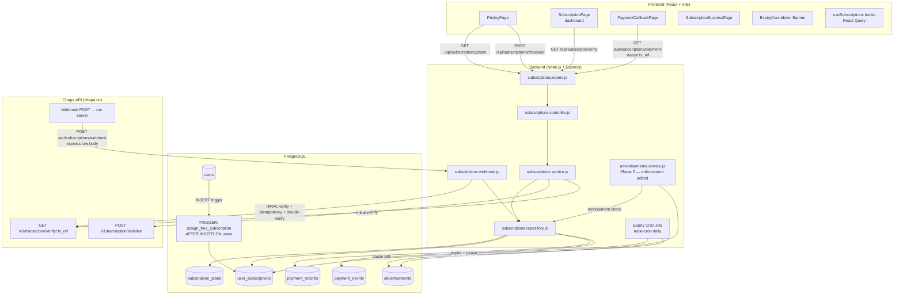
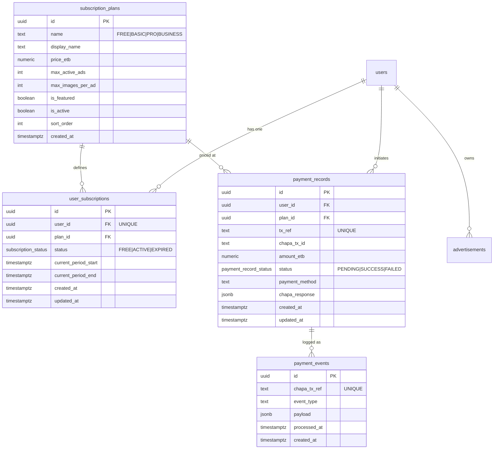
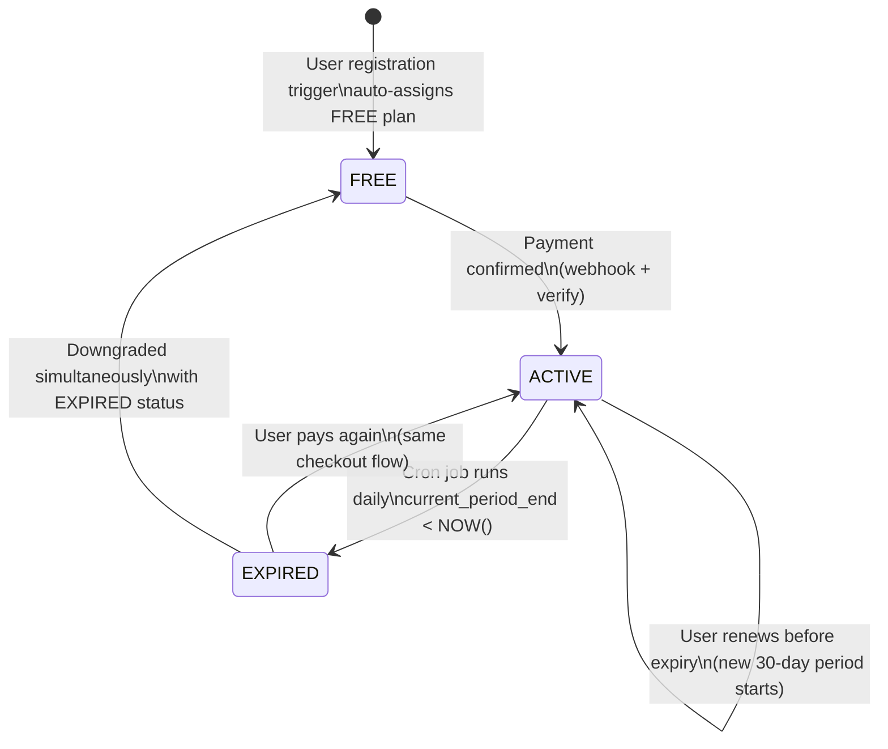
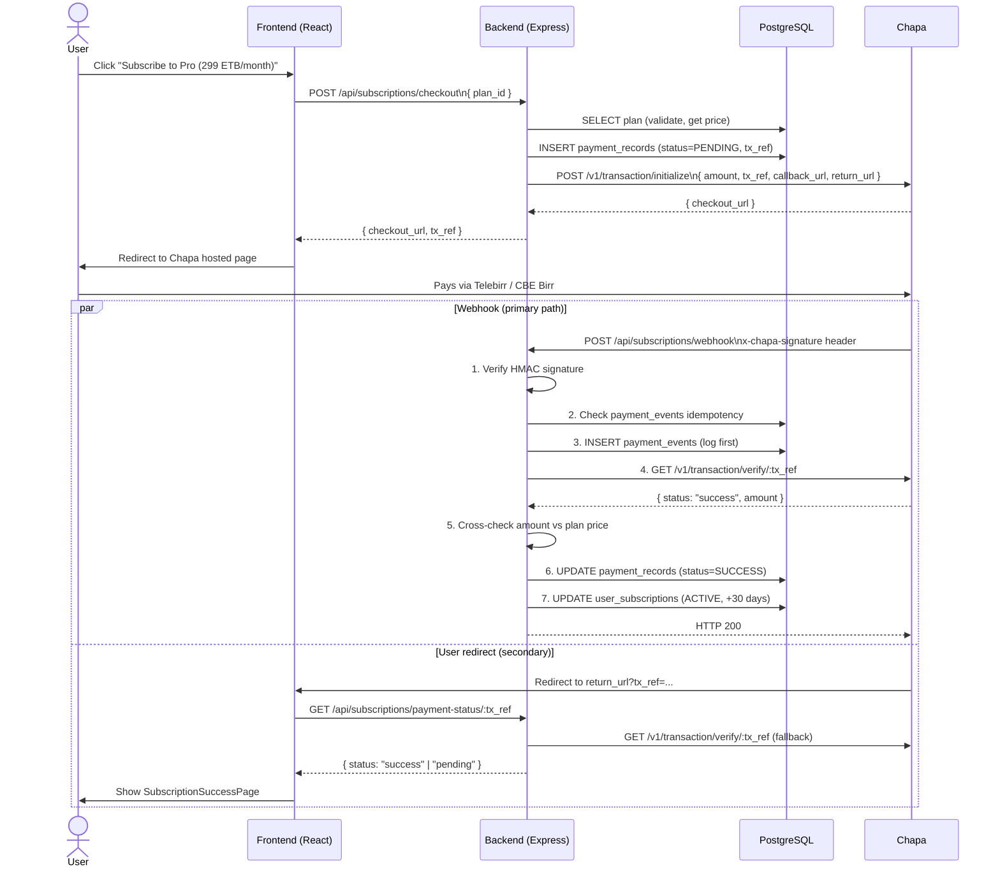
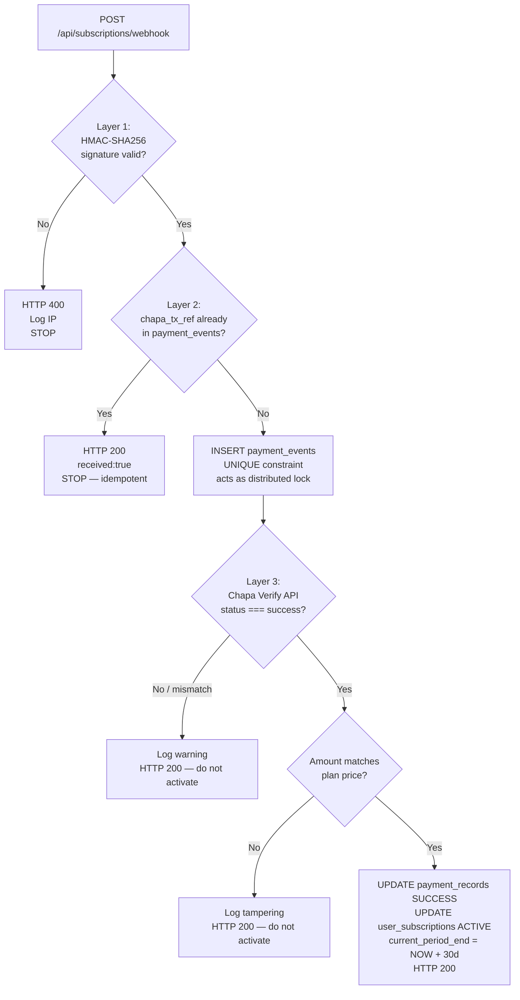
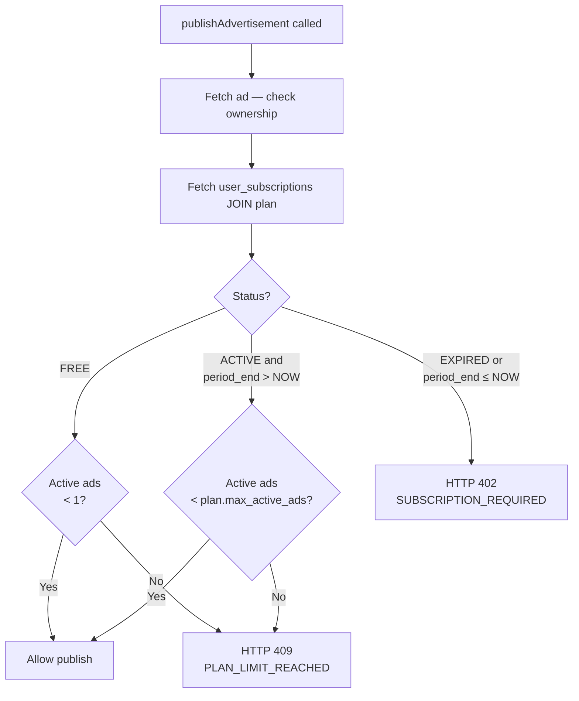
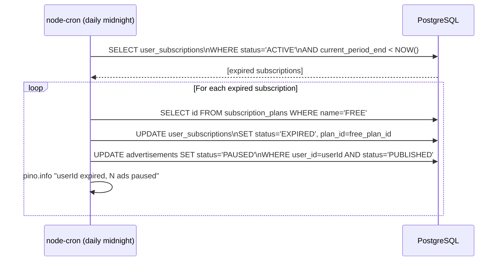
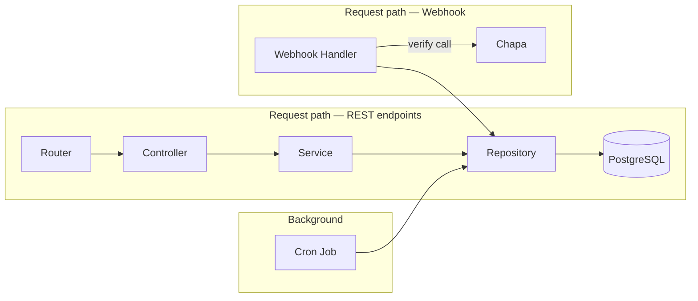

# Design Document: Subscription & Payment System (Phase 6)

> **Feature:** subscription-payment-system
> **Phase:** 6 — Subscriptions & Payments
> **Stack:** Node.js + Express · React + Vite · PostgreSQL
> **Currency:** Ethiopian Birr (ETB)
> **Payment gateway:** Chapa (unifies Telebirr, CBE Birr, Awash, Dashen, M-Pesa)
> **Depends on:** Phase 5 — Advertisement System ✅

---

## Overview

Phase 6 adds the revenue engine to the Ethiopian SaaS advertisement management platform. Before this phase, any registered user can publish unlimited advertisements for free. After Phase 6, every advertiser must hold an active subscription plan to publish listings. Plans are priced in ETB and paid via Chapa — the Ethiopian payment gateway that unifies Telebirr, CBE Birr, Awash, Dashen, and M-Pesa under a single API integration.

Because Ethiopian mobile-money systems (Telebirr, CBE Birr) do not support automatic recurring charges, subscriptions are manual-renewal monthly cycles. Each subscription grants exactly 30 days of access. At expiry, a daily cron job pauses the user's published advertisements and downgrades them to the FREE tier until they pay again. A free tier (0 ETB, 1 active ad, 3 images/ad) is auto-assigned to every new user via a database trigger, ensuring every advertiser always has exactly one subscription row and enforcement logic remains consistent.

The three pillars of the design are: (1) a Chapa payment integration with three-layer webhook security (HMAC signature → idempotency → double-verify), (2) server-side enforcement injected into the existing `publishAdvertisement()` and `addImage()` paths from Phase 5, and (3) a React frontend with a pricing page, subscription dashboard, and payment callback flow.

---

## Part I — High-Level Design

### 1. System Architecture



### 2. Component Responsibility Map

| Layer | File | Responsibility |
|---|---|---|
| Route | `subscriptions.routes.js` | Declares HTTP verbs/paths; applies middleware (authenticate, validate, raw-body for webhook) |
| Controller | `subscriptions.controller.js` | Parses `req`, calls service, sends `res`; no business logic |
| Service | `subscriptions.service.js` | Business rules: plan validation, tx_ref generation, Chapa API calls, subscription activation |
| Webhook | `subscriptions.webhook.js` | Webhook-only entry point: HMAC check → idempotency → verify → activate |
| Repository | `subscriptions.repository.js` | All SQL; parameterised queries only; no HTTP or business logic |
| Schemas | `subscriptions.schemas.js` | Zod 4 validation schemas; rejects any client-controlled fields |
| Cron | `subscriptions.cron.js` | Daily expiry sweep; runs on server startup via `node-cron` |
| Config | `config/index.js` | Adds `CHAPA_SECRET_KEY` and `CHAPA_WEBHOOK_SECRET` via `env()` helper |

### 3. Data Model Overview



### 4. Subscription Plan Tiers

| Plan | Price (ETB/month) | Max Active Ads | Max Images/Ad | Featured Badge |
|---|---|---|---|---|
| **FREE** | 0 | 1 | 3 | No |
| **BASIC** | 99 | 5 | 5 | No |
| **PRO** | 299 | 20 | 10 | Yes |
| **BUSINESS** | 799 | 100 | 10 | Yes |

> Prices are stored in `subscription_plans` — changing them requires only a DB row update, not a code deploy.

### 5. Subscription Lifecycle



### 6. Payment Flow (Happy Path)



### 7. Webhook Security — Three Layers



### 8. Subscription Enforcement — Advertisement Publish Gate



### 9. Daily Expiry Cron Job



### 10. Frontend Component Map

```
frontend/src/
├── pages/
│   ├── PricingPage.jsx                    ← /pricing (public)
│   ├── SubscriptionPage.jsx               ← /dashboard/subscription (auth)
│   ├── PaymentCallbackPage.jsx            ← /subscription/callback (auth)
│   └── SubscriptionSuccessPage.jsx        ← /subscription/success (auth)
└── features/subscriptions/
    ├── components/
    │   ├── PlanCard.jsx                   ← one plan tile (name, ETB price, limits, CTA)
    │   ├── PlanComparisonTable.jsx        ← feature matrix table
    │   ├── SubscriptionStatus.jsx         ← plan badge + expiry date for dashboard
    │   ├── UsageBar.jsx                   ← "7 of 20 ads used" progress bar
    │   └── ExpiryCountdown.jsx            ← "Expires in 3 days — Renew Now" banner
    ├── hooks/
    │   └── useSubscriptions.js            ← React Query hooks (see §II.7)
    └── services/
        └── subscriptionsService.js        ← Axios calls to /api/subscriptions/*
```

### 11. New API Routes

Base path: `/api/subscriptions`

| Method | Path | Auth | Body Parser | Description |
|---|---|---|---|---|
| `GET` | `/plans` | Public | `express.json()` | List all active plans (ETB prices) |
| `GET` | `/my` | JWT | `express.json()` | Current subscription + usage |
| `POST` | `/checkout` | JWT | `express.json()` | Initialize Chapa — returns `checkout_url` |
| `GET` | `/payment-status/:tx_ref` | JWT | `express.json()` | Manual fallback: verify a payment |
| `GET` | `/history` | JWT | `express.json()` | Paginated payment history |
| `POST` | `/webhook` | Chapa only | `express.raw()` | HMAC-verified webhook receiver |

> The webhook route **must** be mounted before `app.use(express.json())` in `app.js`.

### 12. Error Codes

| HTTP | Code | Trigger |
|---|---|---|
| 402 | `SUBSCRIPTION_REQUIRED` | Subscription expired or user on FREE plan trying second publish |
| 409 | `PLAN_LIMIT_REACHED` | Active ad count is at plan maximum |
| 409 | `IMAGE_LIMIT_REACHED` | Image count is at plan maximum for this ad |
| 404 | `PLAN_NOT_FOUND` | `plan_id` does not reference an active plan |
| 409 | `ALREADY_ON_ACTIVE_PLAN` | User already has an ACTIVE paid subscription |
| 409 | `FREE_PLAN_NO_CHECKOUT` | Cannot create a Chapa checkout for the FREE plan |
| 400 | `WEBHOOK_SIGNATURE_INVALID` | Chapa HMAC check failed |
| 400 | `PAYMENT_AMOUNT_MISMATCH` | Verified amount ≠ expected plan price |
| 404 | `PAYMENT_NOT_FOUND` | `tx_ref` does not exist in `payment_records` |
| 422 | `VALIDATION_ERROR` | Zod schema validation failed |

---

## Part II — Low-Level Design

### 1. Database Migrations (016–020)

#### Migration 016 — `subscription_plans`

```sql
-- 016_create_subscription_plans.sql
CREATE TABLE IF NOT EXISTS subscription_plans (
  id                 UUID           PRIMARY KEY DEFAULT gen_random_uuid(),
  name               TEXT           NOT NULL UNIQUE
                       CHECK (name IN ('FREE', 'BASIC', 'PRO', 'BUSINESS')),
  display_name       TEXT           NOT NULL,
  price_etb          NUMERIC(10, 2) NOT NULL DEFAULT 0.00 CHECK (price_etb >= 0),
  max_active_ads     INTEGER        NOT NULL CHECK (max_active_ads > 0),
  max_images_per_ad  INTEGER        NOT NULL CHECK (max_images_per_ad > 0),
  is_featured        BOOLEAN        NOT NULL DEFAULT FALSE,
  is_active          BOOLEAN        NOT NULL DEFAULT TRUE,
  sort_order         INTEGER        NOT NULL DEFAULT 0,
  created_at         TIMESTAMPTZ    NOT NULL DEFAULT now()
);

-- Seed the four plans (ETB prices)
INSERT INTO subscription_plans
  (name, display_name, price_etb, max_active_ads, max_images_per_ad, is_featured, sort_order)
VALUES
  ('FREE',     'Free',     0.00,   1,   3, FALSE, 0),
  ('BASIC',    'Basic',    99.00,  5,   5, FALSE, 1),
  ('PRO',      'Pro',      299.00, 20,  10, TRUE,  2),
  ('BUSINESS', 'Business', 799.00, 100, 10, TRUE,  3)
ON CONFLICT (name) DO NOTHING;
```

#### Migration 017 — `user_subscriptions`

```sql
-- 017_create_user_subscriptions.sql
CREATE TYPE subscription_status AS ENUM ('FREE', 'ACTIVE', 'EXPIRED');

CREATE TABLE IF NOT EXISTS user_subscriptions (
  id                   UUID                PRIMARY KEY DEFAULT gen_random_uuid(),
  user_id              UUID                NOT NULL UNIQUE
                          REFERENCES users (id) ON DELETE CASCADE,
  plan_id              UUID                NOT NULL
                          REFERENCES subscription_plans (id) ON DELETE RESTRICT,
  status               subscription_status NOT NULL DEFAULT 'FREE',
  current_period_start TIMESTAMPTZ,        -- NULL for FREE (no paid period)
  current_period_end   TIMESTAMPTZ,        -- NULL for FREE (never expires)
  created_at           TIMESTAMPTZ         NOT NULL DEFAULT now(),
  updated_at           TIMESTAMPTZ         NOT NULL DEFAULT now()
);

CREATE UNIQUE INDEX IF NOT EXISTS idx_user_sub_user_id
  ON user_subscriptions (user_id);
CREATE INDEX IF NOT EXISTS idx_user_sub_status
  ON user_subscriptions (status);
CREATE INDEX IF NOT EXISTS idx_user_sub_period_end
  ON user_subscriptions (current_period_end)
  WHERE current_period_end IS NOT NULL;
```

#### Migration 018 — `payment_records`

```sql
-- 018_create_payment_records.sql
CREATE TYPE payment_record_status AS ENUM ('PENDING', 'SUCCESS', 'FAILED');

CREATE TABLE IF NOT EXISTS payment_records (
  id              UUID                  PRIMARY KEY DEFAULT gen_random_uuid(),
  user_id         UUID                  NOT NULL
                     REFERENCES users (id) ON DELETE CASCADE,
  plan_id         UUID                  NOT NULL
                     REFERENCES subscription_plans (id) ON DELETE RESTRICT,
  tx_ref          TEXT                  NOT NULL UNIQUE,
  chapa_tx_id     TEXT,
  amount_etb      NUMERIC(10, 2)        NOT NULL CHECK (amount_etb > 0),
  status          payment_record_status NOT NULL DEFAULT 'PENDING',
  payment_method  TEXT,
  chapa_response  JSONB,
  created_at      TIMESTAMPTZ           NOT NULL DEFAULT now(),
  updated_at      TIMESTAMPTZ           NOT NULL DEFAULT now()
);

CREATE UNIQUE INDEX IF NOT EXISTS idx_payment_records_tx_ref
  ON payment_records (tx_ref);
CREATE INDEX IF NOT EXISTS idx_payment_records_user_id
  ON payment_records (user_id);
CREATE INDEX IF NOT EXISTS idx_payment_records_status
  ON payment_records (status);
```

#### Migration 019 — `payment_events`

```sql
-- 019_create_payment_events.sql
CREATE TABLE IF NOT EXISTS payment_events (
  id            UUID        PRIMARY KEY DEFAULT gen_random_uuid(),
  chapa_tx_ref  TEXT        NOT NULL UNIQUE,
  event_type    TEXT        NOT NULL,
  payload       JSONB       NOT NULL,
  processed_at  TIMESTAMPTZ NOT NULL DEFAULT now(),
  created_at    TIMESTAMPTZ NOT NULL DEFAULT now()
);

-- Unique constraint on chapa_tx_ref provides idempotency:
-- second INSERT with the same tx_ref will throw a unique violation,
-- preventing duplicate processing even under concurrent webhook delivery.
CREATE UNIQUE INDEX IF NOT EXISTS idx_payment_events_tx_ref
  ON payment_events (chapa_tx_ref);
```

#### Migration 020 — Free Plan Auto-Assign Trigger

```sql
-- 020_add_free_subscription_trigger.sql
CREATE OR REPLACE FUNCTION assign_free_subscription()
RETURNS TRIGGER AS $$
DECLARE
  free_plan_id UUID;
BEGIN
  SELECT id INTO free_plan_id
  FROM subscription_plans
  WHERE name = 'FREE'
  LIMIT 1;

  -- Only insert if free plan exists (migration 016 must run first)
  IF free_plan_id IS NOT NULL THEN
    INSERT INTO user_subscriptions (user_id, plan_id, status)
    VALUES (NEW.id, free_plan_id, 'FREE');
  END IF;

  RETURN NEW;
END;
$$ LANGUAGE plpgsql;

CREATE TRIGGER trg_assign_free_subscription
  AFTER INSERT ON users
  FOR EACH ROW EXECUTE FUNCTION assign_free_subscription();
```

---

### 2. Zod Validation Schemas — `subscriptions.schemas.js`

```javascript
import { z } from 'zod'

const uuidSchema = z.string().uuid('Invalid UUID format')

/**
 * POST /api/subscriptions/checkout
 * Only plan_id is accepted — user_id comes from req.user.id (JWT).
 * Amount, tx_ref, and status are NEVER accepted from the client.
 */
export const checkoutSchema = z.object({
  body: z.object({
    plan_id: uuidSchema,
  }).strict(),
})

/**
 * GET /api/subscriptions/payment-status/:tx_ref
 * tx_ref format: sub_<userId>_<unixTimestampMs>
 */
export const paymentStatusParamSchema = z.object({
  params: z.object({
    tx_ref: z
      .string()
      .min(1)
      .max(200)
      .regex(/^sub_[a-zA-Z0-9_-]+$/, 'Invalid tx_ref format'),
  }),
})

/**
 * GET /api/subscriptions/history
 */
export const paymentHistoryQuerySchema = z.object({
  query: z.object({
    page: z.coerce.number().int().positive().optional(),
    page_size: z.coerce.number().int().positive().max(100).optional(),
  }).optional(),
})
```

---

### 3. Repository — `subscriptions.repository.js`

Key function signatures and their SQL:

```javascript
import pool from '../../db/index.js'

/**
 * List all active subscription plans ordered by sort_order.
 * @returns {Promise<object[]>}
 */
export async function findAllActivePlans() {
  const result = await pool.query(
    `SELECT id, name, display_name, price_etb, max_active_ads,
            max_images_per_ad, is_featured, sort_order
     FROM subscription_plans
     WHERE is_active = TRUE
     ORDER BY sort_order ASC`
  )
  return result.rows
}

/**
 * Find a plan by ID (active only).
 * @param {string} planId
 * @returns {Promise<object|null>}
 */
export async function findPlanById(planId) {
  const result = await pool.query(
    `SELECT id, name, display_name, price_etb, max_active_ads,
            max_images_per_ad, is_featured
     FROM subscription_plans
     WHERE id = $1 AND is_active = TRUE`,
    [planId]
  )
  return result.rows[0] || null
}

/**
 * Find the FREE plan row.
 * @returns {Promise<object>}
 */
export async function findFreePlan() {
  const result = await pool.query(
    `SELECT id, name, display_name, price_etb, max_active_ads, max_images_per_ad
     FROM subscription_plans WHERE name = 'FREE' LIMIT 1`
  )
  return result.rows[0]
}

/**
 * Find a user's current subscription with plan details joined.
 * @param {string} userId
 * @returns {Promise<object|null>}
 */
export async function findByUserId(userId) {
  const result = await pool.query(
    `SELECT
       us.id, us.user_id, us.status,
       us.current_period_start, us.current_period_end,
       us.created_at, us.updated_at,
       sp.id          AS plan_id,
       sp.name        AS plan_name,
       sp.display_name AS plan_display_name,
       sp.price_etb,
       sp.max_active_ads,
       sp.max_images_per_ad,
       sp.is_featured
     FROM user_subscriptions us
     JOIN subscription_plans sp ON us.plan_id = sp.id
     WHERE us.user_id = $1`,
    [userId]
  )
  return result.rows[0] || null
}

/**
 * Count a user's currently PUBLISHED advertisements (for plan limit enforcement).
 * @param {string} userId
 * @returns {Promise<number>}
 */
export async function countPublishedAdsByUserId(userId) {
  const result = await pool.query(
    `SELECT COUNT(*) AS total
     FROM advertisements
     WHERE user_id = $1 AND status = 'PUBLISHED'`,
    [userId]
  )
  return parseInt(result.rows[0].total, 10)
}

/**
 * Insert a PENDING payment record before redirecting to Chapa.
 * @param {object} data
 * @returns {Promise<object>}
 */
export async function createPaymentRecord({ userId, planId, txRef, amountEtb }) {
  const result = await pool.query(
    `INSERT INTO payment_records (user_id, plan_id, tx_ref, amount_etb, status)
     VALUES ($1, $2, $3, $4, 'PENDING')
     RETURNING *`,
    [userId, planId, txRef, amountEtb]
  )
  return result.rows[0]
}

/**
 * Find a payment record by tx_ref.
 * @param {string} txRef
 * @returns {Promise<object|null>}
 */
export async function findPaymentByTxRef(txRef) {
  const result = await pool.query(
    `SELECT pr.*, sp.price_etb, sp.name AS plan_name
     FROM payment_records pr
     JOIN subscription_plans sp ON pr.plan_id = sp.id
     WHERE pr.tx_ref = $1`,
    [txRef]
  )
  return result.rows[0] || null
}

/**
 * Atomically activate a subscription after successful payment.
 * Updates payment_records and user_subscriptions in one transaction.
 *
 * @param {object} params
 * @param {string} params.txRef
 * @param {string} params.chapaTxId
 * @param {string} params.paymentMethod
 * @param {object} params.chapaResponse   - Full verify API response (stored as JSONB)
 * @param {string} params.userId
 * @param {string} params.planId
 * @returns {Promise<void>}
 */
export async function activateSubscription({
  txRef, chapaTxId, paymentMethod, chapaResponse, userId, planId
}) {
  const client = await pool.connect()
  try {
    await client.query('BEGIN')

    // 1. Mark payment as SUCCESS
    await client.query(
      `UPDATE payment_records
       SET status = 'SUCCESS',
           chapa_tx_id = $1,
           payment_method = $2,
           chapa_response = $3,
           updated_at = now()
       WHERE tx_ref = $4`,
      [chapaTxId, paymentMethod, JSON.stringify(chapaResponse), txRef]
    )

    // 2. Activate subscription with new 30-day period
    await client.query(
      `UPDATE user_subscriptions
       SET plan_id = $1,
           status = 'ACTIVE',
           current_period_start = now(),
           current_period_end = now() + INTERVAL '30 days',
           updated_at = now()
       WHERE user_id = $2`,
      [planId, userId]
    )

    await client.query('COMMIT')
  } catch (err) {
    await client.query('ROLLBACK')
    throw err
  } finally {
    client.release()
  }
}

/**
 * Check whether a tx_ref has already been processed (idempotency).
 * @param {string} txRef
 * @returns {Promise<boolean>}
 */
export async function paymentEventExists(txRef) {
  const result = await pool.query(
    'SELECT 1 FROM payment_events WHERE chapa_tx_ref = $1 LIMIT 1',
    [txRef]
  )
  return result.rowCount > 0
}

/**
 * Log a webhook event into the immutable payment_events audit table.
 * The UNIQUE constraint on chapa_tx_ref acts as a distributed lock.
 * @param {object} data
 * @returns {Promise<void>}
 */
export async function insertPaymentEvent({ txRef, eventType, payload }) {
  await pool.query(
    `INSERT INTO payment_events (chapa_tx_ref, event_type, payload, processed_at)
     VALUES ($1, $2, $3, now())`,
    [txRef, eventType, JSON.stringify(payload)]
  )
}

/**
 * Find all ACTIVE subscriptions past their period_end (for cron job).
 * @returns {Promise<object[]>}
 */
export async function findExpiredActiveSubscriptions() {
  const result = await pool.query(
    `SELECT us.id, us.user_id, us.plan_id
     FROM user_subscriptions us
     WHERE us.status = 'ACTIVE'
       AND us.current_period_end < NOW()`
  )
  return result.rows
}

/**
 * Expire a subscription and downgrade to FREE plan.
 * Atomically pauses all the user's PUBLISHED advertisements.
 *
 * @param {string} subscriptionId
 * @param {string} userId
 * @param {string} freePlanId
 * @returns {Promise<number>} Count of paused advertisements
 */
export async function expireSubscription(subscriptionId, userId, freePlanId) {
  const client = await pool.connect()
  try {
    await client.query('BEGIN')

    await client.query(
      `UPDATE user_subscriptions
       SET status = 'EXPIRED', plan_id = $1, updated_at = now()
       WHERE id = $2`,
      [freePlanId, subscriptionId]
    )

    const pauseResult = await client.query(
      `UPDATE advertisements
       SET status = 'PAUSED', updated_at = now()
       WHERE user_id = $1 AND status = 'PUBLISHED'
       RETURNING id`,
      [userId]
    )

    await client.query('COMMIT')
    return pauseResult.rowCount
  } catch (err) {
    await client.query('ROLLBACK')
    throw err
  } finally {
    client.release()
  }
}

/**
 * Get paginated payment history for a user.
 * @param {string} userId
 * @param {number} page
 * @param {number} pageSize
 * @returns {Promise<{ rows: object[], total: number }>}
 */
export async function findPaymentHistory(userId, page = 1, pageSize = 20) {
  const offset = (page - 1) * pageSize

  const countResult = await pool.query(
    'SELECT COUNT(*) AS total FROM payment_records WHERE user_id = $1',
    [userId]
  )
  const total = parseInt(countResult.rows[0].total, 10)

  const dataResult = await pool.query(
    `SELECT pr.id, pr.tx_ref, pr.chapa_tx_id, pr.amount_etb,
            pr.status, pr.payment_method, pr.created_at, pr.updated_at,
            sp.name AS plan_name, sp.display_name AS plan_display_name
     FROM payment_records pr
     JOIN subscription_plans sp ON pr.plan_id = sp.id
     WHERE pr.user_id = $1
     ORDER BY pr.created_at DESC
     LIMIT $2 OFFSET $3`,
    [userId, pageSize, offset]
  )

  return { rows: dataResult.rows, total }
}
```

---

### 4. Service — `subscriptions.service.js`

```javascript
import crypto from 'crypto'
import { createError } from '../../utils/index.js'
import logger from '../../utils/logger.js'
import { config } from '../../config/index.js'
import * as repo from './subscriptions.repository.js'

// ── Constants ─────────────────────────────────────────────────────────────────

const CHAPA_INITIALIZE_URL = 'https://api.chapa.co/v1/transaction/initialize'
const CHAPA_VERIFY_URL     = 'https://api.chapa.co/v1/transaction/verify'

// ── Plan listing ──────────────────────────────────────────────────────────────

/**
 * List all active subscription plans.
 * @returns {Promise<object[]>}
 */
export async function listPlans() {
  return repo.findAllActivePlans()
}

// ── Current subscription ──────────────────────────────────────────────────────

/**
 * Get the authenticated user's subscription with live usage count.
 *
 * @param {string} userId - From req.user.id
 * @returns {Promise<object>}
 */
export async function getMySubscription(userId) {
  const subscription = await repo.findByUserId(userId)

  if (!subscription) {
    // Edge case: user existed before migration 020 trigger was added.
    // Auto-assign FREE on first call.
    const freePlan = await repo.findFreePlan()
    await repo.activateSubscription({ /* assign free — see note */ })
    throw createError('Subscription not found', 404, 'SUBSCRIPTION_NOT_FOUND')
  }

  const activeAdCount = await repo.countPublishedAdsByUserId(userId)

  const daysRemaining = subscription.current_period_end
    ? Math.max(0, Math.ceil(
        (new Date(subscription.current_period_end) - new Date()) / (1000 * 60 * 60 * 24)
      ))
    : null

  return {
    id: subscription.id,
    status: subscription.status,
    current_period_start: subscription.current_period_start,
    current_period_end: subscription.current_period_end,
    days_remaining: daysRemaining,
    plan: {
      id: subscription.plan_id,
      name: subscription.plan_name,
      display_name: subscription.plan_display_name,
      price_etb: parseFloat(subscription.price_etb),
      max_active_ads: subscription.max_active_ads,
      max_images_per_ad: subscription.max_images_per_ad,
      is_featured: subscription.is_featured,
    },
    usage: {
      active_ads: activeAdCount,
      remaining_ads: Math.max(0, subscription.max_active_ads - activeAdCount),
    },
  }
}

// ── Checkout ──────────────────────────────────────────────────────────────────

/**
 * Initialize a Chapa checkout session for the given plan.
 *
 * Preconditions:
 *   - userId is valid and authenticated
 *   - planId references an active, non-FREE plan
 *   - User does not already have an ACTIVE subscription (optional: allow upgrade)
 *
 * Postconditions:
 *   - A PENDING payment_record row exists with the generated tx_ref
 *   - Returns { checkout_url, tx_ref } to the controller
 *
 * @param {string} userId
 * @param {string} planId
 * @param {object} userProfile - { email, first_name, last_name } from JWT / user lookup
 * @returns {Promise<{ checkout_url: string, tx_ref: string }>}
 */
export async function initializeCheckout(userId, planId, userProfile) {
  // 1. Validate plan
  const plan = await repo.findPlanById(planId)
  if (!plan) {
    throw createError('Plan not found', 404, 'PLAN_NOT_FOUND')
  }
  if (plan.name === 'FREE') {
    throw createError(
      'Cannot create a checkout session for the FREE plan',
      409,
      'FREE_PLAN_NO_CHECKOUT'
    )
  }

  // 2. Generate tx_ref on the server — never from client input
  const txRef = `sub_${userId}_${Date.now()}`

  // 3. Save PENDING payment record before calling Chapa
  await repo.createPaymentRecord({
    userId,
    planId: plan.id,
    txRef,
    amountEtb: plan.price_etb,
  })

  // 4. Call Chapa initialize API
  const chapaBody = {
    amount: plan.price_etb.toString(),
    currency: 'ETB',
    email: userProfile.email,
    first_name: userProfile.first_name || 'User',
    last_name: userProfile.last_name || '',
    tx_ref: txRef,
    callback_url: `${config.frontendUrl}/subscription/callback`,
    return_url: `${config.frontendUrl}/subscription/success`,
    customization: {
      title: `${plan.display_name} Plan Subscription`,
      description: `Monthly subscription to the ${plan.display_name} plan (ETB ${plan.price_etb}/month)`,
    },
  }

  const chapaRes = await fetch(CHAPA_INITIALIZE_URL, {
    method: 'POST',
    headers: {
      'Content-Type': 'application/json',
      Authorization: `Bearer ${config.chapa.secretKey}`,
    },
    body: JSON.stringify(chapaBody),
  })

  const chapaData = await chapaRes.json()

  if (chapaData.status !== 'success' || !chapaData.data?.checkout_url) {
    logger.error({ userId, planId, chapaData }, 'Chapa initialize failed')
    throw createError('Payment gateway error — please try again', 502, 'CHAPA_ERROR')
  }

  logger.info({ userId, planId: plan.id, txRef }, 'Checkout initialized')

  return {
    checkout_url: chapaData.data.checkout_url,
    tx_ref: txRef,
  }
}

// ── Payment status (manual fallback) ─────────────────────────────────────────

/**
 * Check the status of a payment and activate the subscription if confirmed.
 * This is the fallback for when the webhook hasn't arrived yet.
 *
 * @param {string} txRef
 * @param {string} userId - To verify ownership of the payment
 * @returns {Promise<{ status: 'pending' | 'success' | 'failed', subscription?: object }>}
 */
export async function checkPaymentStatus(txRef, userId) {
  const paymentRecord = await repo.findPaymentByTxRef(txRef)
  if (!paymentRecord) {
    throw createError('Payment not found', 404, 'PAYMENT_NOT_FOUND')
  }
  if (paymentRecord.user_id !== userId) {
    throw createError('Payment not found', 404, 'PAYMENT_NOT_FOUND')
  }

  // Already confirmed — just return current subscription
  if (paymentRecord.status === 'SUCCESS') {
    const subscription = await getMySubscription(userId)
    return { status: 'success', subscription }
  }

  // Check with Chapa
  const verifyRes = await fetch(`${CHAPA_VERIFY_URL}/${txRef}`, {
    headers: { Authorization: `Bearer ${config.chapa.secretKey}` },
  })
  const verifyData = await verifyRes.json()

  if (verifyData.status !== 'success') {
    return { status: 'pending' }
  }

  // Activate (same logic as webhook handler — reuse activateSubscriptionFromVerify)
  await activateSubscriptionFromVerify({
    txRef,
    verifyData,
    paymentRecord,
  })

  const subscription = await getMySubscription(userId)
  return { status: 'success', subscription }
}

/**
 * Activate a subscription from a verified Chapa response.
 * Shared by both webhook handler and payment-status fallback.
 *
 * @param {object} params
 * @param {string} params.txRef
 * @param {object} params.verifyData    - Chapa verify API response
 * @param {object} params.paymentRecord - DB row from payment_records
 */
export async function activateSubscriptionFromVerify({ txRef, verifyData, paymentRecord }) {
  const verifiedAmount = parseFloat(verifyData.data.amount)
  const expectedAmount = parseFloat(paymentRecord.price_etb || paymentRecord.amount_etb)

  if (verifiedAmount !== expectedAmount) {
    logger.error(
      { txRef, verifiedAmount, expectedAmount },
      'Amount mismatch — possible tampering'
    )
    throw createError('Payment amount mismatch', 400, 'PAYMENT_AMOUNT_MISMATCH')
  }

  await repo.activateSubscription({
    txRef,
    chapaTxId: verifyData.data.id || verifyData.data.reference,
    paymentMethod: verifyData.data.payment_method || 'unknown',
    chapaResponse: verifyData,
    userId: paymentRecord.user_id,
    planId: paymentRecord.plan_id,
  })

  logger.info(
    { txRef, userId: paymentRecord.user_id, planId: paymentRecord.plan_id },
    'Subscription activated'
  )
}

// ── Payment history ───────────────────────────────────────────────────────────

/**
 * Get paginated payment history for the authenticated user.
 * @param {string} userId
 * @param {object} query - { page, page_size }
 * @returns {Promise<{ payments: object[], pagination: object }>}
 */
export async function getPaymentHistory(userId, query) {
  const page = Math.max(1, query.page || 1)
  const pageSize = Math.min(100, query.page_size || 20)

  const { rows, total } = await repo.findPaymentHistory(userId, page, pageSize)
  const totalPages = Math.ceil(total / pageSize)

  return {
    payments: rows,
    pagination: {
      page,
      page_size: pageSize,
      total,
      total_pages: totalPages,
      has_next: page < totalPages,
      has_prev: page > 1,
    },
  }
}
```

---

### 5. Webhook Handler — `subscriptions.webhook.js`

```javascript
import crypto from 'crypto'
import logger from '../../utils/logger.js'
import { config } from '../../config/index.js'
import * as repo from './subscriptions.repository.js'
import { activateSubscriptionFromVerify } from './subscriptions.service.js'

const CHAPA_VERIFY_URL = 'https://api.chapa.co/v1/transaction/verify'

/**
 * HMAC-SHA256 signature verification.
 * Uses crypto.timingSafeEqual to prevent timing attacks.
 *
 * Precondition: rawBody is a Buffer (express.raw() guarantees this).
 *
 * @param {Buffer} rawBody
 * @param {string} signatureHeader - Value of x-chapa-signature
 * @returns {boolean}
 */
function verifyChapaSignature(rawBody, signatureHeader) {
  if (!signatureHeader) return false

  const expectedSignature = crypto
    .createHmac('sha256', config.chapa.webhookSecret)
    .update(rawBody)
    .digest('hex')

  try {
    const expected = Buffer.from(expectedSignature, 'hex')
    const received = Buffer.from(signatureHeader, 'hex')

    if (expected.length !== received.length) return false
    return crypto.timingSafeEqual(expected, received)
  } catch {
    return false
  }
}

/**
 * POST /api/subscriptions/webhook
 * Called by Chapa when a payment completes.
 *
 * Route must be mounted with express.raw({ type: 'application/json' }).
 * Must be registered BEFORE app.use(express.json()) in app.js.
 *
 * Three-layer security:
 *   1. HMAC signature verification
 *   2. Idempotency check (payment_events UNIQUE on chapa_tx_ref)
 *   3. Chapa Verify API double-confirmation
 */
export async function handleWebhook(req, res) {
  // ── Layer 1: HMAC signature check ────────────────────────────────────────
  const signature = req.headers['x-chapa-signature']
  const rawBody = req.body // Buffer because of express.raw()

  if (!verifyChapaSignature(rawBody, signature)) {
    logger.warn({ ip: req.ip, path: req.path }, 'Webhook: invalid HMAC signature')
    return res.status(400).json({ error: 'WEBHOOK_SIGNATURE_INVALID' })
  }

  let payload
  try {
    payload = JSON.parse(rawBody.toString('utf8'))
  } catch {
    return res.status(400).json({ error: 'Invalid JSON payload' })
  }

  const txRef = payload.tx_ref
  const eventType = payload.event || 'charge.completed'

  if (!txRef) {
    return res.status(400).json({ error: 'Missing tx_ref' })
  }

  // ── Layer 2: Idempotency check ────────────────────────────────────────────
  const alreadyProcessed = await repo.paymentEventExists(txRef)
  if (alreadyProcessed) {
    logger.info({ txRef }, 'Webhook: duplicate event — already processed')
    return res.status(200).json({ received: true })
  }

  // Insert event log FIRST (UNIQUE constraint is the distributed lock)
  try {
    await repo.insertPaymentEvent({ txRef, eventType, payload })
  } catch (err) {
    // Unique violation means another instance just inserted it — idempotent exit
    if (err.code === '23505') {
      return res.status(200).json({ received: true })
    }
    logger.error({ err, txRef }, 'Webhook: failed to insert payment_event')
    return res.status(500).json({ error: 'Internal error' })
  }

  // Only process "success" webhooks
  if (payload.status !== 'success') {
    logger.info({ txRef, status: payload.status }, 'Webhook: non-success event logged')
    return res.status(200).json({ received: true })
  }

  // ── Layer 3: Chapa Verify API double-confirmation ─────────────────────────
  let verifyData
  try {
    const verifyRes = await fetch(`${CHAPA_VERIFY_URL}/${txRef}`, {
      headers: { Authorization: `Bearer ${config.chapa.secretKey}` },
    })
    verifyData = await verifyRes.json()
  } catch (err) {
    logger.error({ err, txRef }, 'Webhook: Chapa verify API call failed')
    // Return 200 so Chapa does not retry — the event is logged and can be reconciled
    return res.status(200).json({ received: true })
  }

  if (verifyData.status !== 'success') {
    logger.error({ txRef, verifyData }, 'Webhook/verify mismatch — not activating')
    return res.status(200).json({ received: true })
  }

  // Fetch payment record for amount cross-check
  const paymentRecord = await repo.findPaymentByTxRef(txRef)
  if (!paymentRecord) {
    logger.error({ txRef }, 'Webhook: payment_record not found for tx_ref')
    return res.status(200).json({ received: true })
  }

  try {
    await activateSubscriptionFromVerify({ txRef, verifyData, paymentRecord })
  } catch (err) {
    logger.error({ err, txRef }, 'Webhook: subscription activation failed')
    return res.status(200).json({ received: true }) // avoid Chapa retry storm
  }

  return res.status(200).json({ received: true })
}
```

---

### 6. Routes — `subscriptions.routes.js`

```javascript
import { Router } from 'express'
import express from 'express'
import { authenticate } from '../../middleware/authenticate.js'
import { validate } from '../../middleware/validate.js'
import * as ctrl from './subscriptions.controller.js'
import { handleWebhook } from './subscriptions.webhook.js'
import {
  checkoutSchema,
  paymentStatusParamSchema,
  paymentHistoryQuerySchema,
} from './subscriptions.schemas.js'

const router = Router()

// ── Webhook — express.raw() must be first; mounted before global express.json() ─
router.post(
  '/webhook',
  express.raw({ type: 'application/json' }),
  handleWebhook
)

// ── Public ────────────────────────────────────────────────────────────────────
router.get('/plans', ctrl.getPlans)

// ── Authenticated ─────────────────────────────────────────────────────────────
router.get('/my', authenticate, ctrl.getMySubscription)
router.post('/checkout', authenticate, validate(checkoutSchema), ctrl.createCheckout)
router.get(
  '/payment-status/:tx_ref',
  authenticate,
  validate(paymentStatusParamSchema),
  ctrl.getPaymentStatus
)
router.get(
  '/history',
  authenticate,
  validate(paymentHistoryQuerySchema),
  ctrl.getPaymentHistory
)

export default router
```

> **`app.js` change required** — the webhook sub-route uses `express.raw()` inline on the route itself, so no change is needed to the global middleware order. The raw body parser is scoped only to `/api/subscriptions/webhook`.

---

### 7. Controller — `subscriptions.controller.js`

```javascript
import { sendSuccess } from '../../utils/index.js'
import * as service from './subscriptions.service.js'
import logger from '../../utils/logger.js'

export async function getPlans(req, res, next) {
  try {
    const plans = await service.listPlans()
    sendSuccess(res, plans)
  } catch (err) { next(err) }
}

export async function getMySubscription(req, res, next) {
  try {
    const subscription = await service.getMySubscription(req.user.id)
    sendSuccess(res, subscription)
  } catch (err) { next(err) }
}

export async function createCheckout(req, res, next) {
  try {
    // User profile is needed for Chapa's hosted page (name + email)
    // Fetched from the JWT payload — extend JWT claims or do a user lookup
    const userProfile = {
      email: req.user.email,
      first_name: req.user.first_name || req.user.name || 'User',
      last_name: req.user.last_name || '',
    }
    const result = await service.initializeCheckout(
      req.user.id,
      req.body.plan_id,
      userProfile
    )
    sendSuccess(res, result, 201)
  } catch (err) { next(err) }
}

export async function getPaymentStatus(req, res, next) {
  try {
    const result = await service.checkPaymentStatus(
      req.params.tx_ref,
      req.user.id
    )
    sendSuccess(res, result)
  } catch (err) { next(err) }
}

export async function getPaymentHistory(req, res, next) {
  try {
    const result = await service.getPaymentHistory(req.user.id, req.query || {})
    sendSuccess(res, result)
  } catch (err) { next(err) }
}
```

---

### 8. Enforcement — Changes to `advertisements.service.js`

Two targeted additions to the existing Phase 5 service. No other changes.

#### 8.1 `publishAdvertisement()` — add subscription gate

Insert after ownership verification, before `adsRepo.updateStatus()`:

```javascript
// In advertisements.service.js — publishAdvertisement()
// ── Subscription enforcement (added Phase 6) ──────────────────────────────
import * as subsRepo from '../subscriptions/subscriptions.repository.js'

// ... after existing ownership and status checks ...

const subscription = await subsRepo.findByUserId(userId)
const now = new Date()
const isActivePaid = (
  subscription?.status === 'ACTIVE' &&
  subscription?.current_period_end &&
  new Date(subscription.current_period_end) > now
)
const isOnFreePlan = (
  !subscription || subscription.status === 'FREE'
)

if (!isActivePaid && !isOnFreePlan) {
  // EXPIRED — period has ended
  throw createError(
    'Your subscription has expired. Please renew to publish advertisements.',
    402,
    'SUBSCRIPTION_REQUIRED'
  )
}

const planMaxAds = subscription?.max_active_ads ?? 1
const activeAdCount = await subsRepo.countPublishedAdsByUserId(userId)

if (activeAdCount >= planMaxAds) {
  const planName = subscription?.plan_display_name || 'Free'
  throw createError(
    `Your ${planName} plan allows ${planMaxAds} active ad(s). ` +
    `Upgrade your plan or archive an existing ad first.`,
    409,
    'PLAN_LIMIT_REACHED'
  )
}
// ── End Phase 6 enforcement ───────────────────────────────────────────────
```

#### 8.2 `addImage()` — use plan image limit instead of hardcoded constant

Replace the hardcoded `MAX_IMAGES` check:

```javascript
// Replace:
//   if (imageCount >= MAX_IMAGES) { ... }
// With:

const subscription = await subsRepo.findByUserId(userId)
const planImageLimit = subscription?.max_images_per_ad ?? 3 // FREE fallback

if (imageCount >= planImageLimit) {
  const planName = subscription?.plan_display_name || 'Free'
  throw createError(
    `Your ${planName} plan allows ${planImageLimit} images per advertisement.`,
    409,
    'IMAGE_LIMIT_REACHED'
  )
}
```

---

### 9. Expiry Cron Job — `subscriptions.cron.js`

```javascript
import cron from 'node-cron'
import logger from '../../utils/logger.js'
import * as repo from './subscriptions.repository.js'

/**
 * Run the subscription expiry sweep.
 * Finds all ACTIVE subscriptions past their period_end,
 * marks them EXPIRED, downgrades to FREE, and pauses published ads.
 */
async function runExpiryJob() {
  logger.info('Expiry job: starting subscription expiry sweep')

  const freePlan = await repo.findFreePlan()
  const expired = await repo.findExpiredActiveSubscriptions()

  logger.info({ count: expired.length }, 'Expiry job: found expired subscriptions')

  for (const sub of expired) {
    try {
      const pausedCount = await repo.expireSubscription(sub.id, sub.user_id, freePlan.id)
      logger.info(
        { userId: sub.user_id, subscriptionId: sub.id, pausedAds: pausedCount },
        'Expiry job: subscription expired, ads paused'
      )
    } catch (err) {
      logger.error({ err, userId: sub.user_id }, 'Expiry job: failed to expire subscription')
    }
  }

  logger.info('Expiry job: sweep complete')
}

/**
 * Schedule the expiry job to run daily at 00:05 (server local time).
 * Called once from server.js at startup.
 */
export function startExpiryJob() {
  cron.schedule('5 0 * * *', () => {
    runExpiryJob().catch((err) =>
      logger.error({ err }, 'Expiry job: unhandled error')
    )
  })
  logger.info('Expiry job: scheduled — runs daily at 00:05')
}
```

> Add `import { startExpiryJob } from './modules/subscriptions/subscriptions.cron.js'` and `startExpiryJob()` call in `server.js` after the server starts listening.

---

### 10. Config — additions to `config/index.js`

```javascript
// Add to the config object in config/index.js:

chapa: {
  secretKey: env('CHAPA_SECRET_KEY', '', true),       // required in production
  webhookSecret: env('CHAPA_WEBHOOK_SECRET', '', true), // required in production
},
```

And add to `backend/.env.example`:

```bash
# Chapa (Ethiopian payment gateway — https://chapa.co)
# Use CHASECK_test_... for development/sandbox
CHAPA_SECRET_KEY=CHASECK_test_...
# Set this yourself in Chapa dashboard → Developer → Webhooks
CHAPA_WEBHOOK_SECRET=your_webhook_secret_string_here
```

---

### 11. Frontend React Query Hooks — `useSubscriptions.js`

```javascript
import { useQuery, useMutation, useQueryClient } from '@tanstack/react-query'
import * as api from '../services/subscriptionsService.js'

// ── Query keys ────────────────────────────────────────────────────────────────
const KEYS = {
  plans: ['subscriptions', 'plans'],
  mine: ['subscriptions', 'my'],
  history: ['subscriptions', 'history'],
  paymentStatus: (txRef) => ['subscriptions', 'payment-status', txRef],
}

/** Fetch all active plans. Stale for 1 hour — plans rarely change. */
export function useSubscriptionPlans() {
  return useQuery({
    queryKey: KEYS.plans,
    queryFn: api.getPlans,
    staleTime: 60 * 60 * 1000,
  })
}

/** Fetch the authenticated user's subscription and usage. */
export function useMySubscription() {
  return useQuery({
    queryKey: KEYS.mine,
    queryFn: api.getMySubscription,
  })
}

/** Fetch the user's payment history. */
export function usePaymentHistory(page = 1) {
  return useQuery({
    queryKey: [...KEYS.history, page],
    queryFn: () => api.getPaymentHistory({ page }),
  })
}

/**
 * Poll payment status after returning from Chapa.
 * Enabled only when txRef is present.
 * Polls every 3 seconds until status is not "pending".
 */
export function usePaymentStatus(txRef) {
  return useQuery({
    queryKey: KEYS.paymentStatus(txRef),
    queryFn: () => api.getPaymentStatus(txRef),
    enabled: Boolean(txRef),
    refetchInterval: (data) =>
      data?.status === 'pending' ? 3000 : false,
  })
}

/** Initiate a Chapa checkout — redirects to Chapa hosted page on success. */
export function useCreateCheckoutSession() {
  const queryClient = useQueryClient()
  return useMutation({
    mutationFn: ({ planId }) => api.createCheckout({ plan_id: planId }),
    onSuccess: (data) => {
      // Redirect to Chapa hosted checkout page
      window.location.href = data.checkout_url
    },
    onSettled: () => {
      queryClient.invalidateQueries({ queryKey: KEYS.mine })
    },
  })
}
```

---

### 12. API Response Examples

#### `GET /api/subscriptions/plans`

```json
{
  "success": true,
  "data": [
    {
      "id": "uuid-free",
      "name": "FREE",
      "display_name": "Free",
      "price_etb": 0,
      "max_active_ads": 1,
      "max_images_per_ad": 3,
      "is_featured": false,
      "sort_order": 0
    },
    {
      "id": "uuid-pro",
      "name": "PRO",
      "display_name": "Pro",
      "price_etb": 299,
      "max_active_ads": 20,
      "max_images_per_ad": 10,
      "is_featured": true,
      "sort_order": 2
    }
  ]
}
```

#### `GET /api/subscriptions/my`

```json
{
  "success": true,
  "data": {
    "id": "uuid-sub",
    "status": "ACTIVE",
    "current_period_start": "2026-08-26T00:00:00Z",
    "current_period_end": "2026-09-25T00:00:00Z",
    "days_remaining": 29,
    "plan": {
      "id": "uuid-pro",
      "name": "PRO",
      "display_name": "Pro",
      "price_etb": 299,
      "max_active_ads": 20,
      "max_images_per_ad": 10,
      "is_featured": true
    },
    "usage": {
      "active_ads": 7,
      "remaining_ads": 13
    }
  }
}
```

#### `POST /api/subscriptions/checkout` — request / response

```json
// Request
{ "plan_id": "uuid-pro" }

// Response 201
{
  "success": true,
  "data": {
    "checkout_url": "https://checkout.chapa.co/checkout/payment/...",
    "tx_ref": "sub_abc123_1724000000000"
  }
}
```

---

### 13. Dependencies to Add

```bash
# Backend — install in backend/
npm install chapa-nodejs@^1.2.0   # Chapa official Node.js SDK (optional; can use fetch directly)
npm install node-cron@^3.0.3      # Cron scheduler for expiry job
```

> Both packages have permissive MIT/ISC licenses and are actively maintained. The `chapa-nodejs` package is maintained by the Chapa team; using `fetch` directly (as shown in the design) is equally valid and has no extra dependency.

---

## Implementation Order

Follow these steps sequentially — each builds on the previous:

1. **Migrations 016–020** — Run `db:migrate`, verify trigger fires on test user creation
2. **Read-only endpoints** — `findAllActivePlans`, `findByUserId`, `GET /plans`, `GET /my`
3. **Webhook handler** — Mount, implement HMAC + idempotency + verify before writing checkout
4. **Checkout endpoint** — `POST /checkout`, test end-to-end in Chapa sandbox
5. **Payment-status fallback** — `GET /payment-status/:tx_ref`
6. **Payment history** — `GET /history`
7. **Enforcement** — Inject into `publishAdvertisement()` and `addImage()`
8. **Expiry cron job** — Register in `server.js`, test with a subscription set to expire 1 minute from now
9. **Frontend** — PricingPage → SubscriptionPage → PaymentCallbackPage → SubscriptionSuccessPage → dashboard banners
10. **Full test suite** — All cases from Testing Plan; verify all Phase 5 tests still pass

---

## Security Summary

| Concern | Mitigation |
|---|---|
| Webhook spoofing | HMAC-SHA256 with `crypto.timingSafeEqual` — no string comparison |
| Duplicate webhook delivery | `UNIQUE` on `payment_events.chapa_tx_ref` — acts as distributed lock |
| Chapa system error sending false success | Chapa Verify API double-confirmation before activation |
| Amount tampering | Cross-check `verifyData.amount` against `payment_records.amount_etb` |
| Client-controlled subscription status | `status` and `current_period_end` never read from request body |
| Client-controlled tx_ref | Generated server-side with `Date.now()` — never from client input |
| Amount sent to Chapa | Taken from `subscription_plans` DB row — never from client |
| Secret key exposure | `CHAPA_SECRET_KEY` and `CHAPA_WEBHOOK_SECRET` in `config/index.js` only; never logged; never returned in API responses |
| Race condition on concurrent webhooks | `INSERT INTO payment_events` with UNIQUE constraint rejects the second concurrent insert with `23505` |

---

## Architecture

See Part I § 1 — System Architecture (Mermaid diagram above) for the full component topology.

The system follows the existing layered architecture: routes → controller → service → repository. A separate webhook handler module (`subscriptions.webhook.js`) is isolated from the main controller to keep the three-layer security logic self-contained. A `subscriptions.cron.js` module registers a daily `node-cron` job at server startup.

The critical architectural constraint is the placement of `express.raw()` on the webhook route. The raw body parser is applied inline on that single route so the global `express.json()` middleware in `app.js` does not interfere. This mirrors the Stripe webhook pattern and is mandatory for HMAC signature verification.



## Components and Interfaces

### subscriptions.repository.js

**Purpose:** Data-access layer — all SQL for subscription and payment tables.

**Interface (key exports):**

```javascript
findAllActivePlans() → Promise<Plan[]>
findPlanById(planId: string) → Promise<Plan | null>
findFreePlan() → Promise<Plan>
findByUserId(userId: string) → Promise<Subscription | null>
countPublishedAdsByUserId(userId: string) → Promise<number>
createPaymentRecord({ userId, planId, txRef, amountEtb }) → Promise<PaymentRecord>
findPaymentByTxRef(txRef: string) → Promise<PaymentRecord | null>
activateSubscription({ txRef, chapaTxId, paymentMethod, chapaResponse, userId, planId }) → Promise<void>
paymentEventExists(txRef: string) → Promise<boolean>
insertPaymentEvent({ txRef, eventType, payload }) → Promise<void>
findExpiredActiveSubscriptions() → Promise<Subscription[]>
expireSubscription(subscriptionId, userId, freePlanId) → Promise<number>
findPaymentHistory(userId, page, pageSize) → Promise<{ rows, total }>
```

**Responsibilities:** Parameterised SQL only; owns all DB transactions; no HTTP, no business logic.

### subscriptions.service.js

**Purpose:** Business logic — plan validation, Chapa API calls, subscription lifecycle.

**Interface (key exports):**

```javascript
listPlans() → Promise<Plan[]>
getMySubscription(userId: string) → Promise<SubscriptionWithUsage>
initializeCheckout(userId, planId, userProfile) → Promise<{ checkout_url, tx_ref }>
checkPaymentStatus(txRef, userId) → Promise<{ status, subscription? }>
activateSubscriptionFromVerify({ txRef, verifyData, paymentRecord }) → Promise<void>
getPaymentHistory(userId, query) → Promise<{ payments, pagination }>
```

**Responsibilities:** Validates plan eligibility; generates `tx_ref`; calls Chapa initialize and verify APIs; delegates to repository; shared activation logic used by both webhook and fallback endpoint.

### subscriptions.webhook.js

**Purpose:** Handles Chapa webhook POSTs with three-layer security.

**Interface:**

```javascript
handleWebhook(req: Request, res: Response) → Promise<void>
// Internal:
verifyChapaSignature(rawBody: Buffer, signatureHeader: string) → boolean
```

**Responsibilities:** HMAC verification; idempotency check; Chapa Verify API call; delegates activation to service layer.

### subscriptions.controller.js

**Purpose:** HTTP layer — extract req params, call service, send response.

**Interface:**

```javascript
getPlans(req, res, next)
getMySubscription(req, res, next)
createCheckout(req, res, next)
getPaymentStatus(req, res, next)
getPaymentHistory(req, res, next)
```

**Responsibilities:** No business logic; always derives `userId` from `req.user.id` (JWT); never from request body.

### subscriptions.cron.js

**Purpose:** Daily subscription expiry sweep.

**Interface:**

```javascript
startExpiryJob() → void   // called once from server.js at startup
```

**Responsibilities:** Schedules `node-cron` at 00:05 daily; calls repository to find expired subscriptions; atomically marks EXPIRED and pauses published ads.

### subscriptions.schemas.js

**Purpose:** Zod 4 validation schemas for request bodies and params.

**Exported schemas:** `checkoutSchema`, `paymentStatusParamSchema`, `paymentHistoryQuerySchema`

**Responsibilities:** Rejects any client-controlled fields (status, tx_ref, amount, user_id); only `plan_id` is accepted in the checkout body.

## Data Models

### Plan

```javascript
{
  id: string,             // UUID
  name: 'FREE' | 'BASIC' | 'PRO' | 'BUSINESS',
  display_name: string,
  price_etb: number,      // ETB, e.g. 299.00
  max_active_ads: number,
  max_images_per_ad: number,
  is_featured: boolean,
  is_active: boolean,
  sort_order: number,
  created_at: string      // ISO 8601
}
```

### Subscription

```javascript
{
  id: string,
  user_id: string,
  plan_id: string,
  status: 'FREE' | 'ACTIVE' | 'EXPIRED',
  current_period_start: string | null,   // null for FREE
  current_period_end: string | null,     // null for FREE (never expires)
  created_at: string,
  updated_at: string
}
```

### PaymentRecord

```javascript
{
  id: string,
  user_id: string,
  plan_id: string,
  tx_ref: string,          // UNIQUE — format: sub_{userId}_{timestamp}
  chapa_tx_id: string | null,
  amount_etb: number,
  status: 'PENDING' | 'SUCCESS' | 'FAILED',
  payment_method: string | null,   // e.g. 'telebirr', 'cbe_birr'
  chapa_response: object | null,   // full Chapa verify response (JSONB)
  created_at: string,
  updated_at: string
}
```

### PaymentEvent (immutable audit log)

```javascript
{
  id: string,
  chapa_tx_ref: string,    // UNIQUE — idempotency key
  event_type: string,      // e.g. 'charge.completed'
  payload: object,         // raw webhook payload (JSONB)
  processed_at: string,
  created_at: string
}
```

**Validation rules:**
- `amount_etb` must be > 0 in `payment_records`
- `plan_id` must reference an `is_active = TRUE` plan
- `user_id` must have exactly one row in `user_subscriptions` (UNIQUE constraint)
- `tx_ref` is immutable after creation; generated server-side only
- `current_period_end` must always be `current_period_start + 30 days` when set

## Correctness Properties

*A property is a characteristic or behavior that should hold true across all valid executions of a system — essentially, a formal statement about what the system should do. Properties serve as the bridge between human-readable specifications and machine-verifiable correctness guarantees.*

### Property 1: Every User Has Exactly One Subscription

*For any* user account created in the system, there exists exactly one `user_subscriptions` row for that user at all times. The UNIQUE constraint on `user_subscriptions.user_id` combined with the database trigger on `users INSERT` guarantees that every user row produces exactly one subscription row, and duplicate subscriptions are structurally impossible.

**Validates: Requirements 1.3, 1.4**

### Property 2: Subscription Status is Server-Controlled Only

*For any* API request to the subscription endpoints, the fields `status`, `current_period_end`, and `plan_id` on `user_subscriptions` are never read from the request body. The only writers are the Webhook_Handler (payment confirmed) and the Expiry_Cron_Job (period ended). The Zod_Validator enforces `.strict()` on the checkout body, and `userId` is always derived from `req.user.id`.

**Validates: Requirements 3.2, 3.3, 8.1, 8.4**

### Property 3: tx_ref Is Server-Generated and Unforgeable

*For any* checkout request from any authenticated user, the `tx_ref` value is always generated server-side in the format `sub_{userId}_{timestampMs}` and is never accepted from the client request body. Ownership of a `tx_ref` is always verified against `req.user.id` before any status query or activation.

**Validates: Requirements 3.2, 8.1**

### Property 4: Payment Activation Is Idempotent

*For any* `tx_ref`, processing the same webhook event twice — whether due to Chapa retry or concurrent delivery to multiple server instances — produces exactly one subscription activation and returns HTTP 200 for both deliveries. The UNIQUE constraint on `payment_events.chapa_tx_ref` ensures the second concurrent INSERT fails with a `23505` unique violation and exits without modifying the subscription.

**Validates: Requirements 4.3, 4.4, 4.5, 9.3**

### Property 5: Amount Integrity Is Enforced End-to-End

*For any* plan checkout, the ETB amount sent to the Chapa initialize API is always taken from `subscription_plans.price_etb` in the database and never from the client. After the webhook, the verified amount from Chapa's Verify API is cross-checked against the stored `payment_records.amount_etb`. Any deviation stops activation and logs a security alert.

**Validates: Requirements 3.3, 4.7, 4.9**

### Property 6: Plan Ad Limit Is Enforced for All Plans

*For any* user on any subscription plan attempting to publish an advertisement, if their count of PUBLISHED advertisements is greater than or equal to `subscription_plans.max_active_ads`, the publish is rejected with HTTP 409 `PLAN_LIMIT_REACHED`. This holds regardless of which plan the user is on and regardless of when the limit was last checked.

**Validates: Requirements 6.2, 6.3**

### Property 7: FREE Plan Users Are Never Subscription-Blocked on First Publish

*For any* user on the FREE plan with zero currently published advertisements, calling `publishAdvertisement` succeeds without a subscription error. The enforcement logic explicitly handles `status === 'FREE'` as a valid publishing state up to `max_active_ads = 1`, so new users who have never paid can always publish their first advertisement.

**Validates: Requirements 6.3, 1.3**

### Property 8: Expiry Enforcement Uses Both Status and Date

*For any* call to `publishAdvertisement`, the enforcement check uses both `user_subscriptions.status` and `current_period_end > NOW()`. An ACTIVE subscription with a past `current_period_end` is treated as expired and returns HTTP 402 `SUBSCRIPTION_REQUIRED`, defending against the gap between a subscription expiring and the cron job running (up to 24 hours).

**Validates: Requirements 6.1, 6.6**

### Property 9: Image Limit Is Always Plan-Derived

*For any* call to `addImage`, the maximum images per advertisement limit is always read from `subscription_plans.max_images_per_ad` for the user's current plan and never from a hardcoded constant. For any plan configuration, once the image count reaches `max_images_per_ad`, the next `addImage` call is rejected with HTTP 409 `IMAGE_LIMIT_REACHED`.

**Validates: Requirements 6.4, 6.5**

### Property 10: Expiry Sweep Is Atomic Per Subscription

*For any* expired ACTIVE subscription found by the Expiry_Cron_Job, the status update to EXPIRED, the plan downgrade to FREE, and the bulk pause of PUBLISHED advertisements all occur within a single database transaction. Either all three changes commit together or none do — partial state (e.g., EXPIRED status without paused ads) cannot be persisted.

**Validates: Requirements 7.1, 7.2**

### Property 11: Webhook Input Validation Rejects Malformed Requests

*For any* request body to `POST /checkout` that contains fields beyond `plan_id`, or any `tx_ref` parameter that does not match `/^sub_[a-zA-Z0-9_-]+$/`, or any `page_size` that exceeds 100 or is non-positive, the Zod_Validator rejects the request with HTTP 422 `VALIDATION_ERROR` before any service logic executes.

**Validates: Requirements 8.1, 8.2, 8.3**

## Error Handling

### Webhook signature failure

**Condition:** `x-chapa-signature` header is absent or HMAC does not match.
**Response:** HTTP 400, `WEBHOOK_SIGNATURE_INVALID`.
**Recovery:** Log the originating IP. Do not process or inspect the payload further. Chapa will not retry on 400.

### Duplicate webhook delivery

**Condition:** `payment_events` already contains a row with the same `chapa_tx_ref`.
**Response:** HTTP 200, `{ received: true }`. No DB changes.
**Recovery:** Idempotent — the subscription is already ACTIVE from the first delivery. No action needed.

### Chapa Verify API returns non-success

**Condition:** Webhook delivered a `status: success` payload but the Verify API independently returns a different status.
**Response:** HTTP 200 (to avoid Chapa retry storm). Log a high-severity warning for manual investigation.
**Recovery:** The `payment_events` row is already written (event logged), but `payment_records` remains PENDING and the subscription is not activated. Reconciliation can be triggered manually via `GET /payment-status/:tx_ref`.

### Amount mismatch

**Condition:** The verified ETB amount from Chapa's Verify API differs from `payment_records.amount_etb`.
**Response:** HTTP 200. Log a security alert. Do not activate.
**Recovery:** Same as above — manual reconciliation via payment-status endpoint.

### Chapa API unavailable (checkout)

**Condition:** The `fetch` call to Chapa initialize times out or returns a non-success status.
**Response:** HTTP 502, `CHAPA_ERROR`. The PENDING `payment_records` row is left in place and will time out naturally.
**Recovery:** The user retries by initiating checkout again. A new `tx_ref` is generated each attempt.

### Subscription expired (publish gate)

**Condition:** `user_subscriptions.status === 'EXPIRED'` or `current_period_end < NOW()`.
**Response:** HTTP 402, `SUBSCRIPTION_REQUIRED` with a human-readable message.
**Recovery:** User is directed to the `/pricing` page to renew.

### Plan limit reached

**Condition:** `countPublishedAdsByUserId >= plan.max_active_ads`.
**Response:** HTTP 409, `PLAN_LIMIT_REACHED` with plan name and limit in the message.
**Recovery:** User must archive/pause an existing advertisement or upgrade their plan.

### FREE plan checkout attempt

**Condition:** `POST /checkout` with the FREE plan's UUID.
**Response:** HTTP 409, `FREE_PLAN_NO_CHECKOUT`.
**Recovery:** No action needed — the FREE plan requires no payment.

## Testing Strategy

### Unit Testing Approach

Each service function is tested in isolation with mocked repository calls. Key unit test cases:

- `initializeCheckout`: throws `FREE_PLAN_NO_CHECKOUT` for the FREE plan; generates `tx_ref` starting with `sub_`; calls `createPaymentRecord` before calling Chapa; returns `checkout_url` from Chapa response.
- `activateSubscriptionFromVerify`: throws `PAYMENT_AMOUNT_MISMATCH` when verified amount differs; calls `activateSubscription` with correct args when amounts match.
- `verifyChapaSignature`: returns `true` for a correctly signed body; returns `false` for wrong secret; returns `false` for swapped lengths; does not throw for malformed hex.

### Property-Based Testing Approach

**Property Test Library:** Node.js built-in `node:test` with manual generators (or `fast-check` if added as a dev dependency).

Key properties:
- For any `tx_ref` value, calling the webhook handler twice with an identical valid payload produces exactly one subscription activation and two HTTP 200 responses.
- For any plan where `price_etb > 0`, the verified amount must equal `price_etb` exactly for activation to proceed — any deviation rejects.
- For any user on the FREE plan with `active_ads < 1`, `publishAdvertisement` succeeds; with `active_ads >= 1`, it throws `PLAN_LIMIT_REACHED`.

### Integration Testing Approach

Integration tests use the Chapa sandbox with test credentials. Key end-to-end test scenarios:

| Category | Test |
|---|---|
| Plans API | Returns 4 active plans with correct ETB prices; inactive plans excluded |
| My subscription | New user returns FREE status; 401 without auth |
| Checkout | Returns `checkout_url` for PRO plan; 409 for FREE plan; 409 without auth; PENDING record in DB |
| Webhook — signature | Valid HMAC → processes; wrong secret → 400; missing header → 400 |
| Webhook — idempotency | Duplicate `tx_ref` → 200, subscription unchanged |
| Webhook — verify mismatch | Mock Chapa Verify returning "failed" → subscription NOT activated |
| Webhook — amount mismatch | Verified amount ≠ plan price → not activated |
| Webhook — success | Full happy path → status ACTIVE, `current_period_end = NOW + 30d` |
| Enforcement — publish | FREE user: 1st publish succeeds; 2nd blocked (409); EXPIRED user blocked (402); PRO user: 20th publish succeeds; 21st blocked |
| Enforcement — images | FREE ad: 3rd image succeeds; 4th blocked; PRO ad: 10th succeeds; 11th blocked |
| Expiry job | ACTIVE subscription with past `period_end` → EXPIRED + ads PAUSED |
| Auto-assign trigger | New user registration → FREE subscription row exists immediately |
| Payment history | Returns all records for user; 401 without auth |
